**17th and 18th September** 
So, we have our project decided on. We're gonna be working on a smart ESP32-powered weather station that contains two modules that communicate wirelessly, one that collects weather data using sensors (will typically be placed outside where weather data is sourced), and another that is connected to a screen and displays this data. It runs on battery and charged by a solar panel. More details will be added soon.

I searched, added, and wired components for our weather tracker and display system including the processor chip (espressif esp32 wroom), ldo, battery points for the solar panel and battery, and a battery charger for the battery. I also added some of the sensors for the weather. Our device will track temperature, humidity, pressure, wind speed, wind direction, rain, and light/UV.

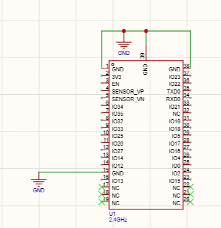

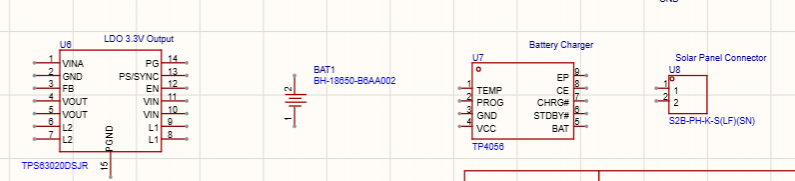

We found suitable modules for temp, pressure, humidity and UV light, but we're still gonna finalize for wind speed, wind direction, and rain (amount of rain fall).

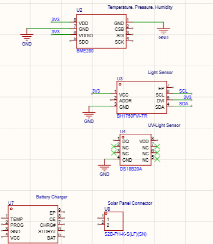

Timelapse: https://lapse.hackclub.com/timelapse/0soD5C5SFuWm

---

**18th September midnight**

I started wiring the ldo. I wired input voltage, switching nodes, and power with necessary caps using the datasheet. I also wired the gpio pins on the processor.

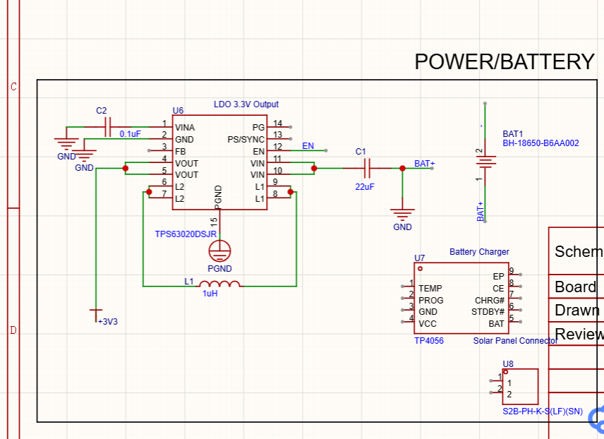

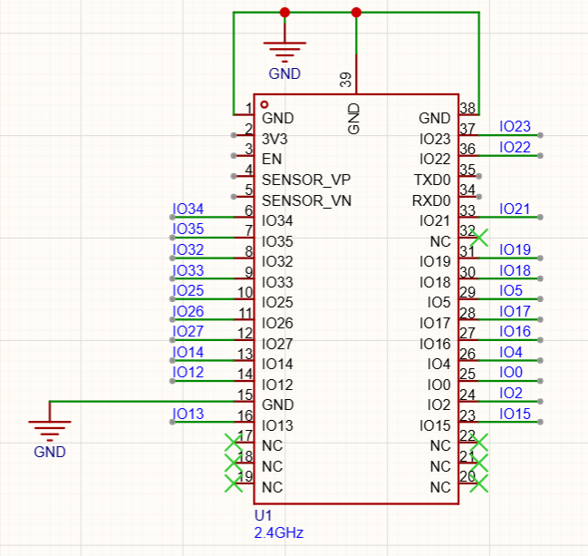

Timelapse: https://lapse.hackclub.com/timelapse/47Nh-5HsW0Z_

---

**19th September**

I finished wiring up the ldo. I wired up enable, power saving, and some other pins. We're gonna use the Adafruit 6V 2W solar panel that has a barrel jack connector, so I added the jack socket (or whatever its calld) that will connect to the jack of the solar panel. I also started wiring the TP4056 to the battery and the solar.

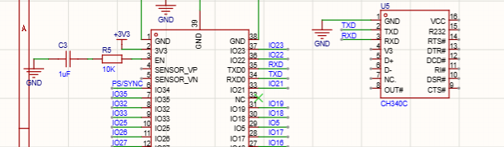

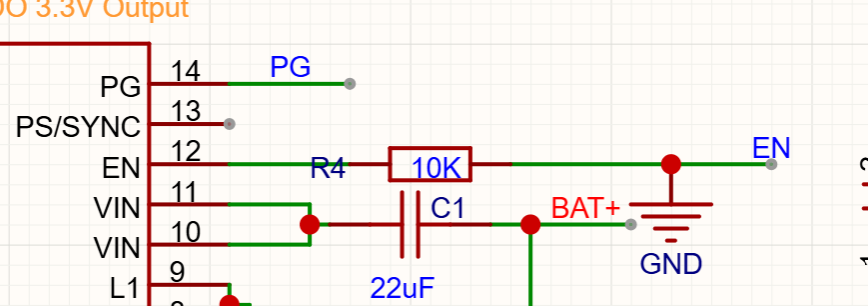

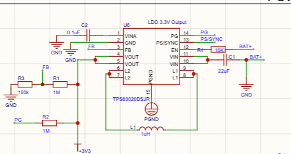

Timelapse: https://lapse.hackclub.com/timelapse/MDIkPO2Eiles
Timelapse 2: https://lapse.hackclub.com/timelapse/ODEb5UjX_YcE

---

**19th September evening**

We decided to not connect status LEDs for the battery charger (CHRG and STDBY), but instead connect them to two separate GPIOs and have it display in our second module when the battery is charging or full. If we happen to run out of GPIOs, which I don't think we will, I'll wire both statuses to one pin.

Anyways, I finished wiring up the battery charger and fixed a lot of bugs in my wiring (for example, shorting VIN, and some other pins). I think there might still be some things I might have wired wrongly, which I'll fix tomorrow.

I also added and wired an NTC temp sensor to avoid charging the battery while it is overheated.

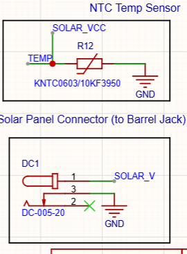

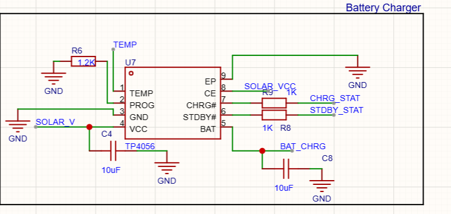

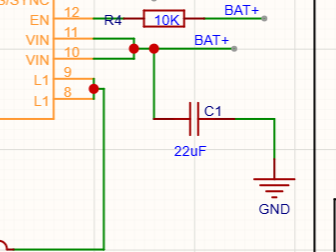

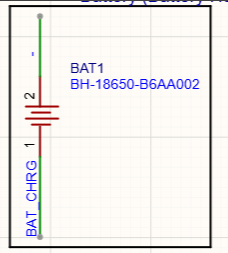

Timelapse: https://lapse.hackclub.com/timelapse/Cc5SS9TyneUY

---

**20th September**

Rounding up wiring for the outdoor-module - I added decoupling capacitors for the battery charger and esp32..

I also added a schottky diode to prevent back charge to the solar panel. For the charging status pins, we decided we would enable pullup internally with code instead. and we removed the resistors I had added to the pins. i also fixed a couple of other wiring mistakes

Then, I began the indoor-module schematic. I added a simple LDO and testpoints for Lipo battery (so we can have a smaller device for that module) and began wiring all the components. We're still thinking of what else would be in the indoor-module, but we want a touch display and it's gonna have a menu screen, and more. We're thinking of adding an NFC tag to the outdoor module to send data to our phones when we tap it.

I also fixed some other wiring bugs in my code.

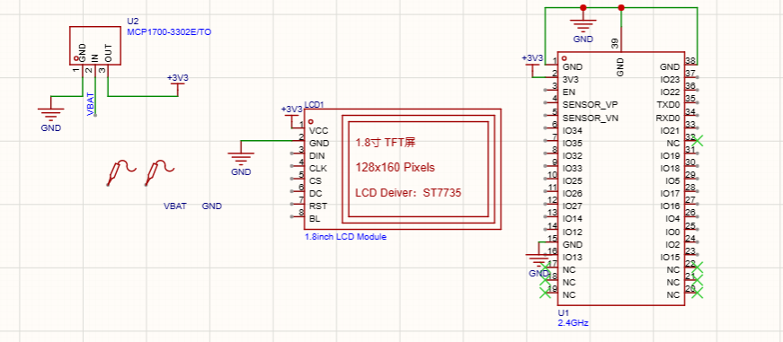

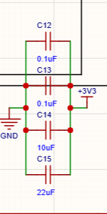

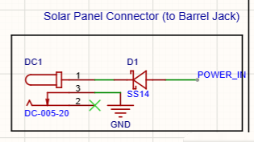

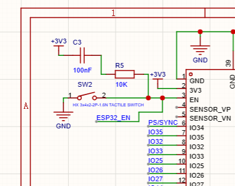

Timelapse: https://lapse.hackclub.com/timelapse/anTcrrIvC8c1

--
### WEEK 2
---

**25th aSeptember**( (Syncing tw)

On the first day, I cross checked our schematic, and fixed some issues with the labels. We added diodes to the power outlets/charging so that our PCB wouldn' make connections to things on the same label that don't need to be connected directly.

We decided to have another temperature module for the internal model, so it could display the difference between both.. My teammate mainly copied most of the sensor and USB-C wiring from the outdoor schematic to the indoor schematic, and changed what needed to be.

We cross-checked all our wiring, and had two of our friends sanity check our wiring. We also ran DRC and removed connections from useless GPIOs. There may still be changes in the future, but we're moving to our PCB now!

