**17th and 18th September** 
So, we have our project decided on. We're gonna be working on a smart ESP32-powered weather station that contains two modules that communicate wirelessly, one that collects weather data using sensors (will typically be placed outside where weather data is sourced), and another that is connected to a screen and displays this data. It runs on battery and charged by a solar panel. More details will be added soon.

I searched, added, and wired components for our weather tracker and display system including the processor chip (espressif esp32 wroom), ldo, battery points for the solar panel and battery, and a battery charger for the battery. I also added some of the sensors for the weather. Our device will track temperature, humidity, pressure, wind speed, wind direction, rain, and light/UV.

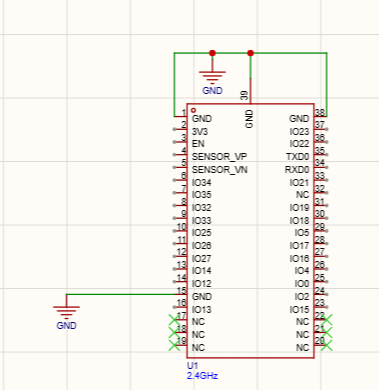

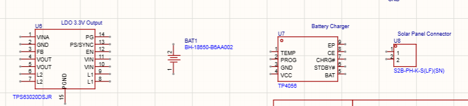

We found suitable modules for temp, pressure, humidity and UV light, but we're still gonna finalize for wind speed, wind direction, and rain (amount of rain fall).

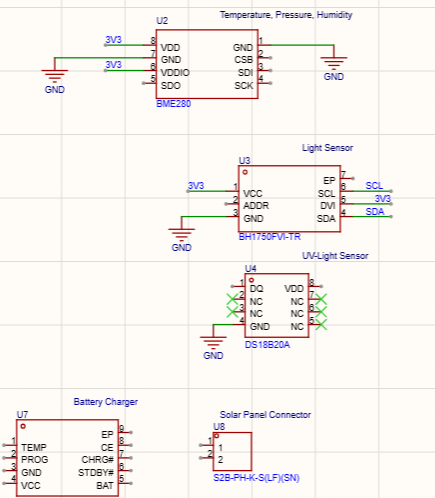

Timelapse: https://lapse.hackclub.com/timelapse/0soD5C5SFuWm

---

**18th September midnight**

I started wiring the ldo. I wired input voltage, switching nodes, and power with necessary caps using the datasheet. I also wired the gpio pins on the processor.

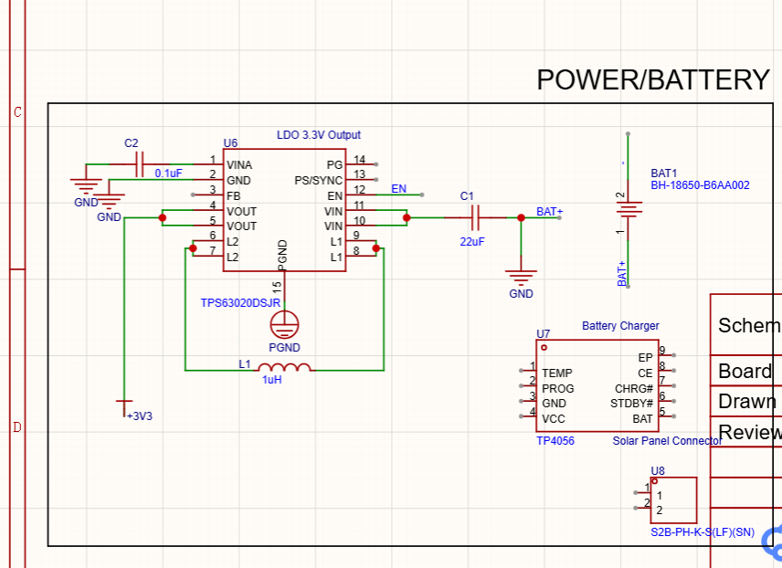

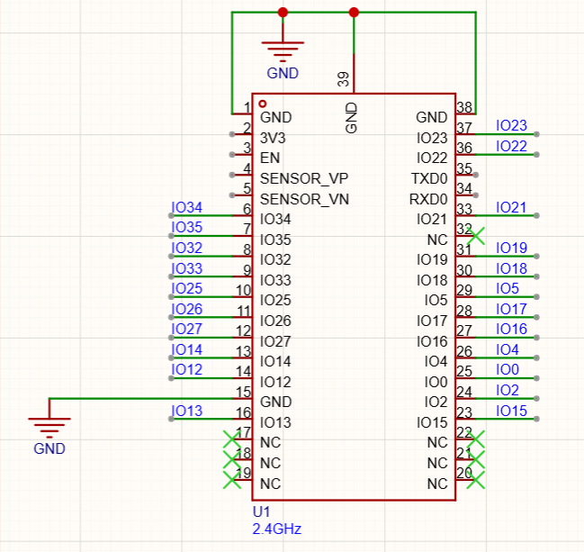

Timelapse: https://lapse.hackclub.com/timelapse/47Nh-5HsW0Z_

---

**19th September**

I finished wiring up the ldo. I wired up enable, power saving, and some other pins. We're gonna use the Adafruit 6V 2W solar panel that has a barrel jack connector, so I added the jack socket (or whatever its calld) that will connect to the jack of the solar panel. I also started wiring the TP4056 to the battery and the solar.

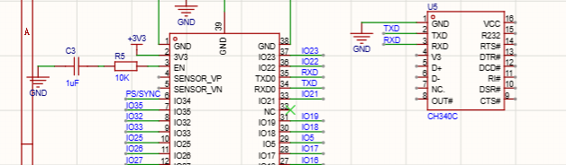

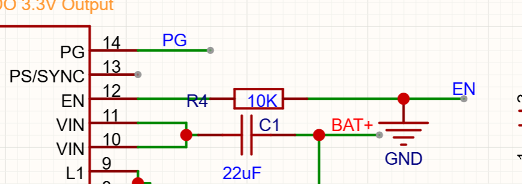

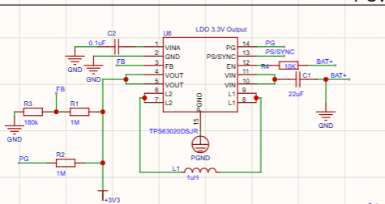

Timelapse: https://lapse.hackclub.com/timelapse/MDIkPO2Eiles
Timelapse 2: https://lapse.hackclub.com/timelapse/ODEb5UjX_YcE

---

**19th September evening**

We decided to not connect status LEDs for the battery charger (CHRG and STDBY), but instead connect them to two separate GPIOs and have it display in our second module when the battery is charging or full. If we happen to run out of GPIOs, which I don't think we will, I'll wire both statuses to one pin.

Anyways, I finished wiring up the battery charger and fixed a lot of bugs in my wiring (for example, shorting VIN, and some other pins). I think there might still be some things I might have wired wrongly, which I'll fix tomorrow.

I also added and wired an NTC temp sensor to avoid charging the battery while it is overheated.

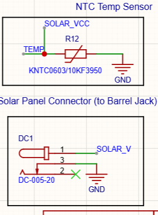

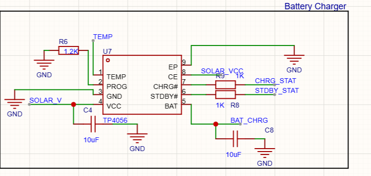

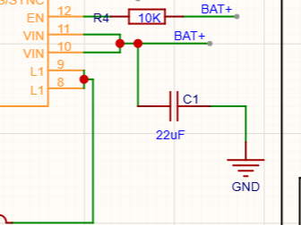

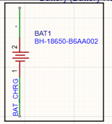

Timelapse: https://lapse.hackclub.com/timelapse/Cc5SS9TyneUY

---

**20th September**

Rounding up wiring for the outdoor-module - I added decoupling capacitors for the battery charger and esp32..

I also added a schottky diode to prevent back charge to the solar panel. For the charging status pins, we decided we would enable pullup internally with code instead. and we removed the resistors I had added to the pins. i also fixed a couple of other wiring mistakes

Then, I began the indoor-module schematic. I added a simple LDO and testpoints for Lipo battery (so we can have a smaller device for that module) and began wiring all the components. We're still thinking of what else would be in the indoor-module, but we want a touch display and it's gonna have a menu screen, and more. We're thinking of adding an NFC tag to the outdoor module to send data to our phones when we tap it.

I also fixed some other wiring bugs in my code.

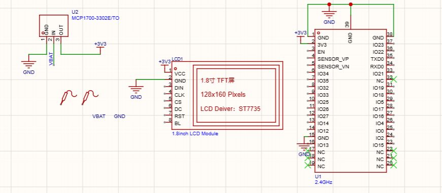

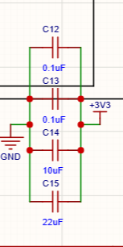

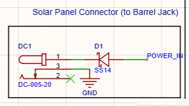

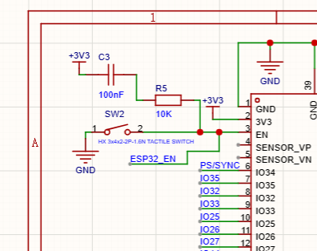

Timelapse: https://lapse.hackclub.com/timelapse/anTcrrIvC8c1

--
### WEEK 2
---

**25th aSeptember**( (Syncing tw)

On the first day, I cross checked our schematic, and fixed some issues with the labels. We added diodes to the power outlets/charging so that our PCB wouldn' make connections to things on the same label that don't need to be connected directly.

We decided to have another temperature module for the internal model, so it could display the difference between both.. My teammate mainly copied most of the sensor and USB-C wiring from the outdoor schematic to the indoor schematic, and changed what needed to be.

We cross-checked all our wiring, and had two of our friends sanity check our wiring. We also ran DRC and removed connections from useless GPIOs. There may still be changes in the future, but we're moving to our PCB now!

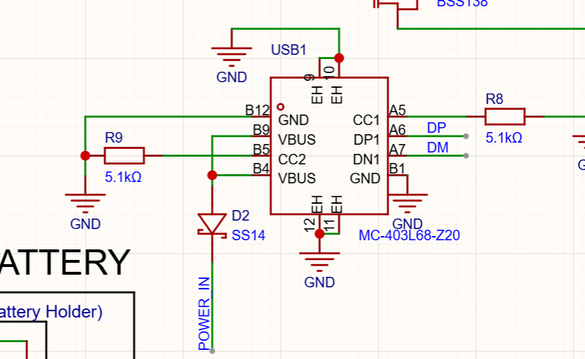

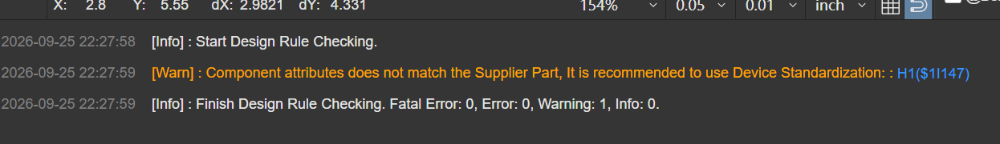

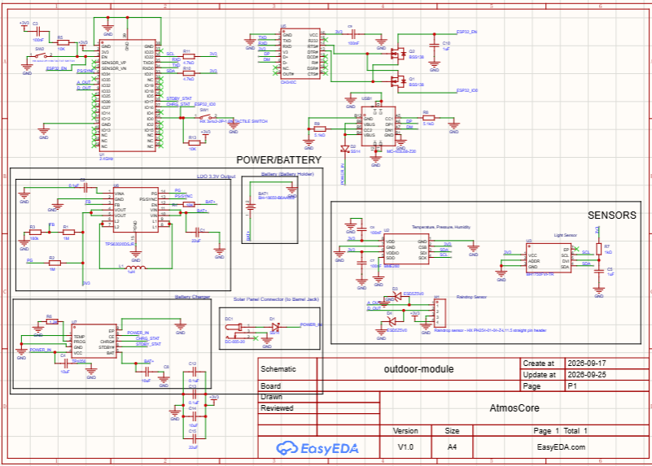

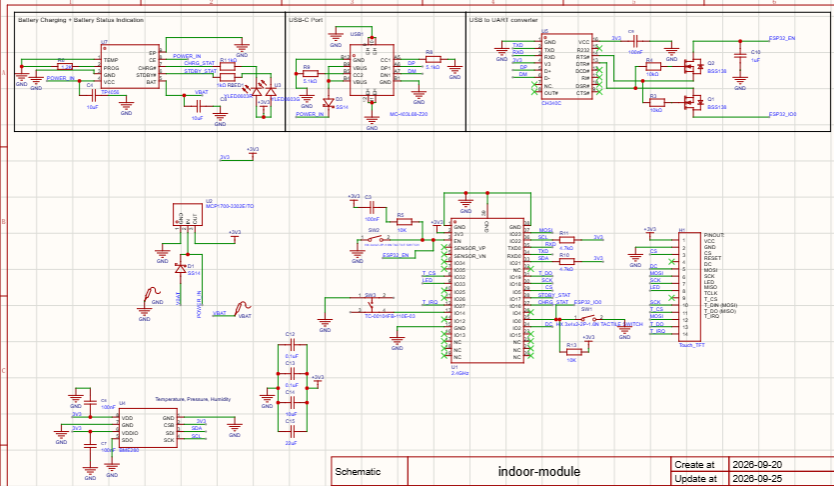

Timelapse (22nd Sept): https://lapse.hackclub.com/timelapse/DbM2U7grEP55
Timelapse (25th Sept): https://lapse.hackclub.com/timelapse/LilQS_6KhUf3

---

**26th September**

We had started placing components in their places. I placed decoupling capacitors where they needed to be. I was making reference to my previous devboard for some guidance. Then I realised two huge mistakess!!! I realsied I never even opened the datasheet for the LDO I added in the internal module (maybe cuz it only had three pins) :(.. Anyways, I didn't add any input or output capacitors, which is bad. But, I later opened the datasheet and fixed that.

The second mistake I had made was the wiring of the EN pin.. It was just wrong, like wrong wrong! :(, and I fixed that asw.

I also changed the automatically assigned capacitor sizes to uniform ones 0603 and 0805 where needed, and updated the pcb! (Now that I think about it, i didn't check resistors.. maybe tmr).

My teammate added a switch to power on, and decided it would be cool to add a radar presence detector so that our device would turn on when somoen walked by or came close.. that makes 3 ways to turn it on (Touch LCD and the button asw)

After placing all the components everywhere, and fixing and ensuring correct wiring, we began routing and we've covered some grounds.. will continue tmr

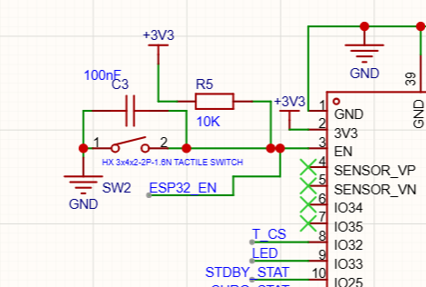

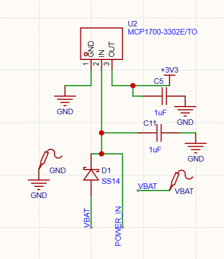

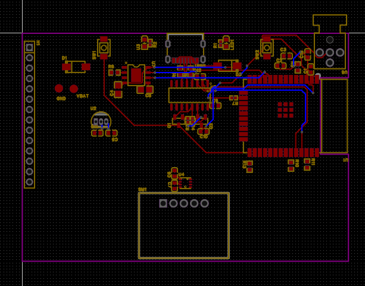

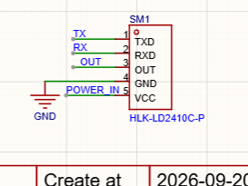

Timelapse: https://lapse.hackclub.com/timelapse/GjsO2iJ3Wp_l

also this 11 mins https://lapse.hackclub.com/timelapse/RbmZFwa_v1Lu

--- 

**27th September**

We finished the indoor module PCB :)! We wired the remainign aprts form yesterday, added ground fills on both sides, and ran DRC.. Then we fixed all our errors.
Only thing that might change maybe the battery pads as they're so small.. We would also defo add some silkscreen for decor.. and info too.

After the indoor PCB, I fixed the same issues that I fixed in the indoor module yday in the outdoor module (used the same micro) and then I also hadn't added an output capacitor to the buck booster.. somehow I had missed that from the datasheet (i used the datasheet, i promise). Thankfully, I noticed.. and I also fixed the input capacitor.. the datasheet recommends 2 x 10uFs and 4 x 22uFs respectively... for the indoor, I just added 22uFs, but I realised it seems to be more effective and cancel out more noise (ig)

If anything, we'll switch them up later. 
Anyways, after fixing things up, we started placing components for the outdoor module.. We changed the FAT battery holder to testpoints/pads instead so we're gonna use those flat LiPo batteries instead (like in the indoor module). I've placed most of the main components and those that go with them, and we'll complete the remaining tomorrow)! So proud of our work so far yayayyayayay!

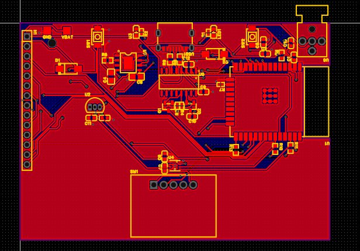

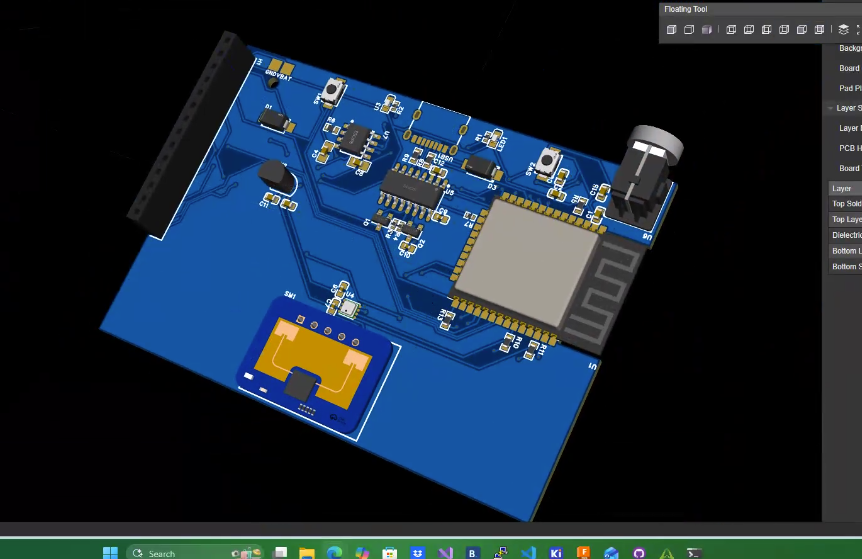

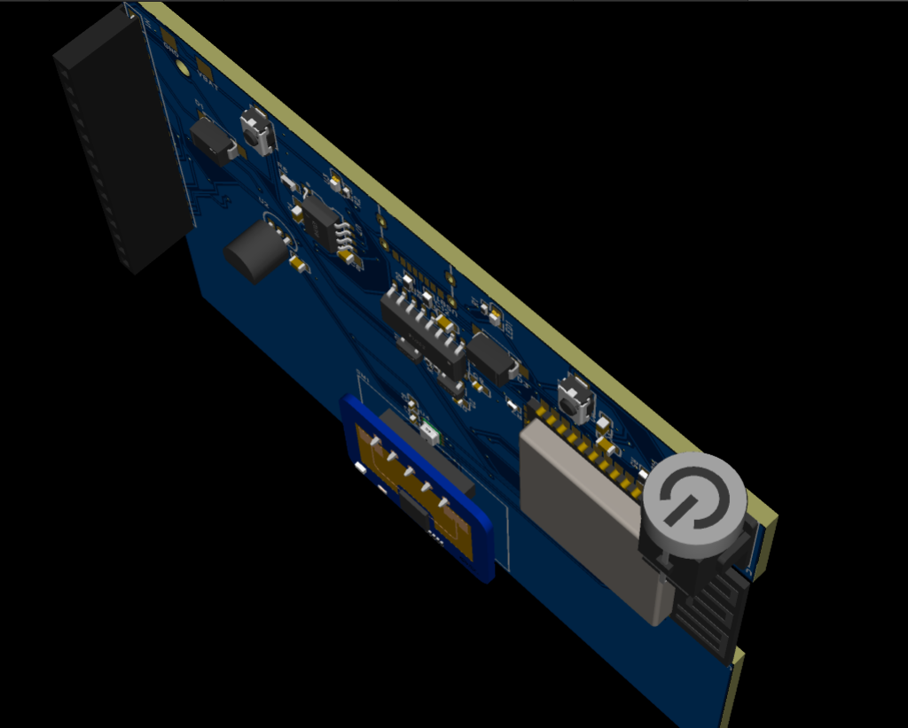

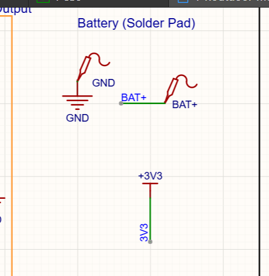

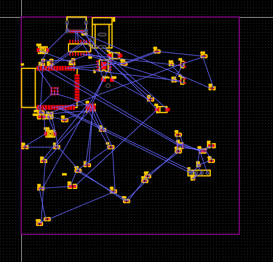

Timelapse: https://lapse.hackclub.com/timelapse/7acM_9xCz0wH

---

### WEEK 3

**2nd October, 2026**

We finished placing components on the outdoor module, and wired it up. And of course, ground fills, DRC and all of that.. and yayya, we're done! We then remembered we needed to add battery measurement voltage dividers so I did that this morning.. and just finished this evening w my teammates help cuz I got stuck! and ofc we fixed all our errors, rebuilt ground fills and.. now we're actually done!.. we hope!

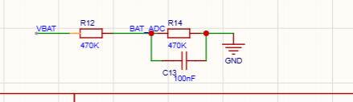

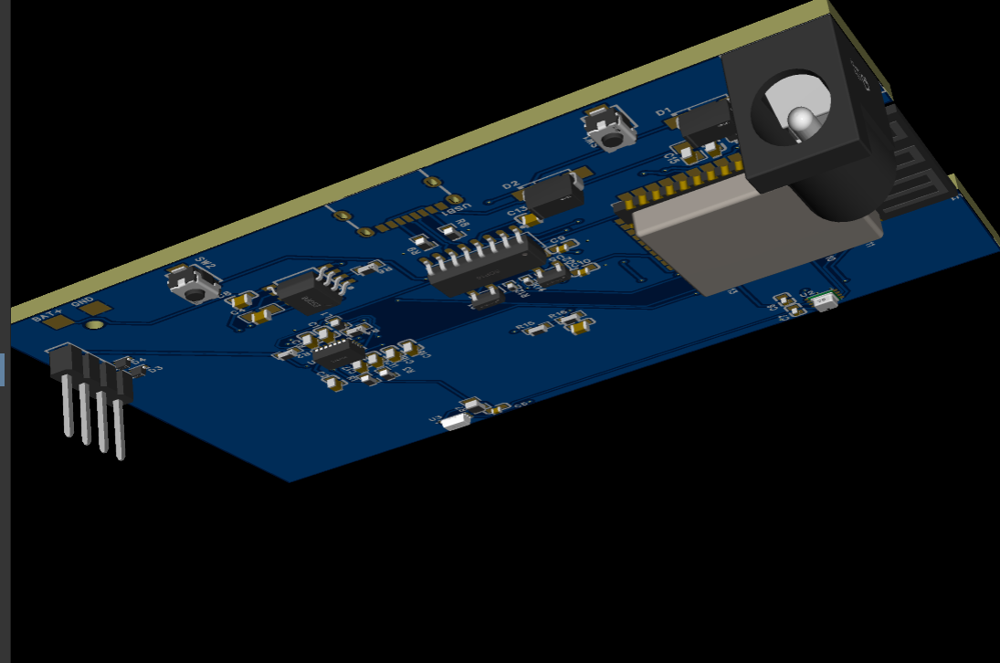

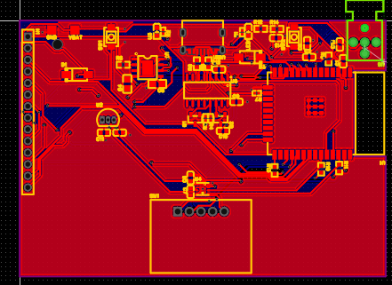

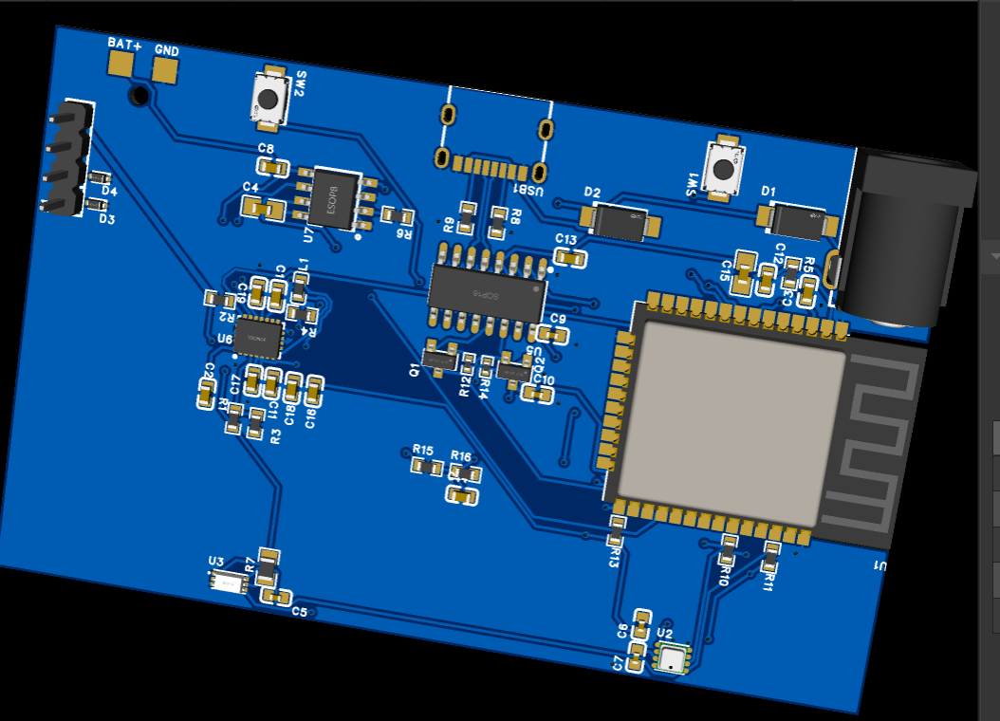

Timelapses: 
https://lapse.hackclub.com/timelapse/n3gh6F-ZVt-m

https://lapse.hackclub.com/timelapse/gxGTGI2P7w6p

https://lapse.hackclub.com/timelapse/05RpBTpiCn64

---

**2nd October evening**

We started off with CAD yesterday!! My teamtate has made the bottom and top covers (still on the top) for the indoor module! He added holes for the on-button and the usb connector! I'm using Onshape for the first time and I also kinda have always hated cad.. but i did contribute to it.. I did the fillets for the bottom aprt of the indoor module yayayya!!

We also kinda realise that we have to make the small boot and reset buttons to be accessible through the cad. we're still working on that.. but I'm gonna get started on FIRMWARE!! cuz my teammate got cad for the most part..!

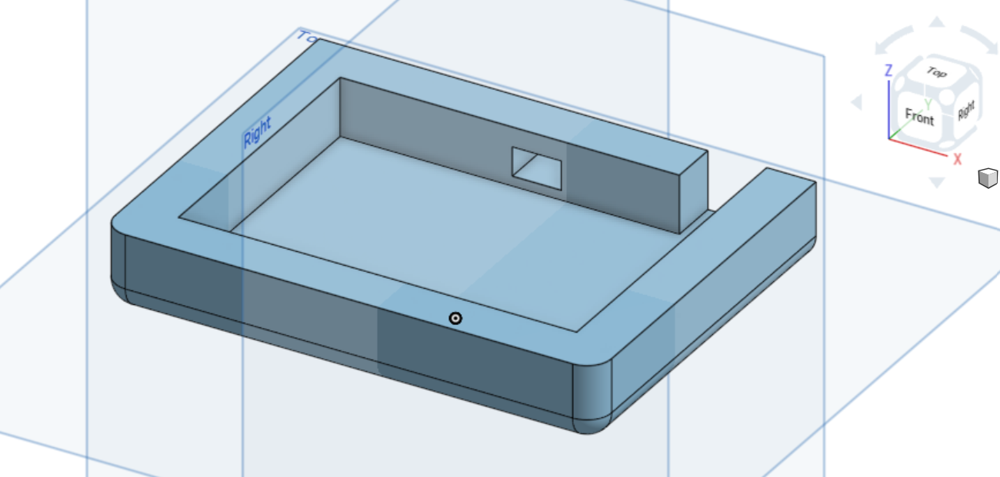

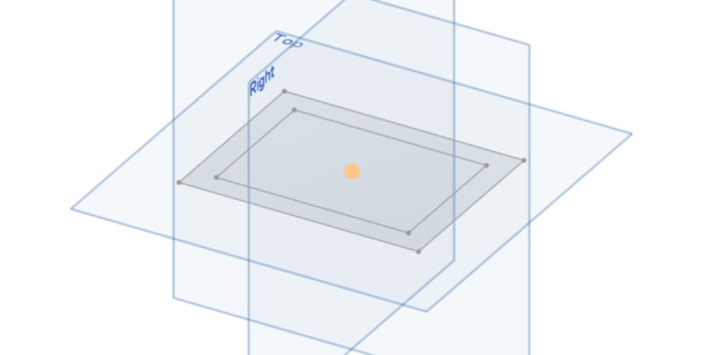

Timelapse: https://lapse.hackclub.com/timelapse/77oZqxya-N3z

---

**3rd October**

So, for the CAD, I did the top layer for the indoor module! Then we realised that the module was covering the radar and it would probably not measure someone's presence. So, I increased the size of the pcb (by 10mm) and moved the radar to the bottom of it!! Then we increased the size of the cad as well .. both top and bottom!!

we did the assemlbly and put aligned all the aprts together! Then my teammate branded it this morning, he had also added holes for the OLED to show and all. now we've added holes for ventilation or to reduce overheating in tboth modules.,

ATMOS CORE CAD IS FINISHED( also we call it iBrick.. cuz it looks like a brick sth Apple will make)!

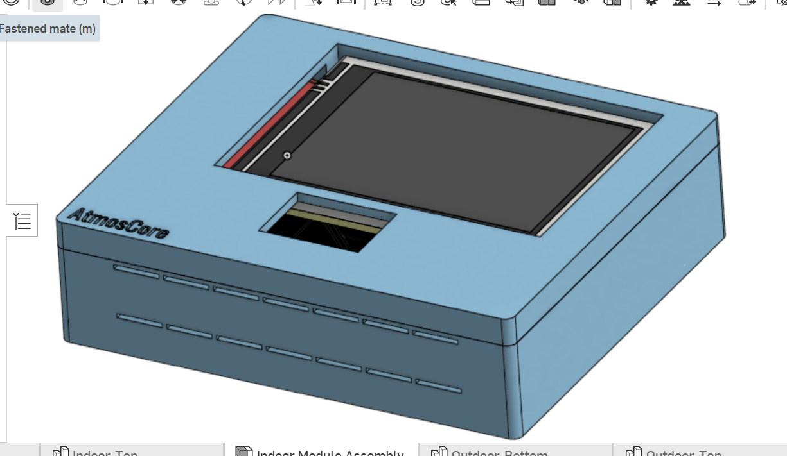
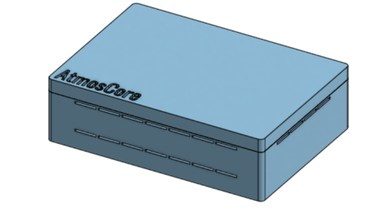
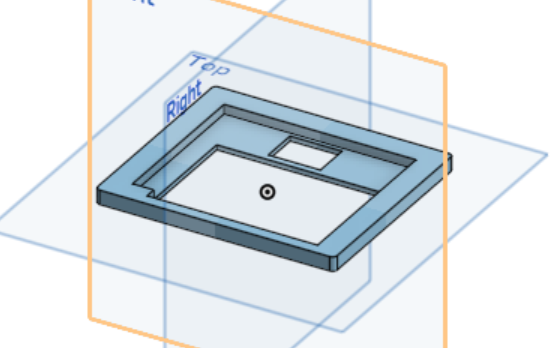
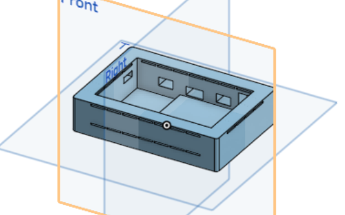
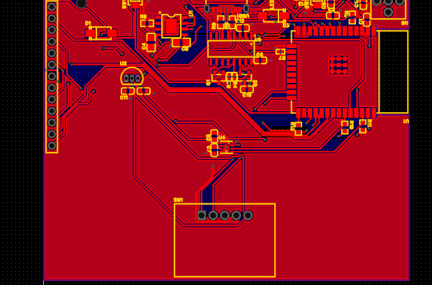

Timelapse: https://lapse.hackclub.com/timelapse/xjRKseYRGz7s

---

**October 4th**
I started writing the previous journal before but didn't commit!

Oke, We're done! Like done done!

For the code, we were first using espidf, then we switched to arduino.. cuz espidf was so low_level and we would have to be writing almost bare metal code!

I know both c and cpp so it wasn't tooo bad, but I had to do reserach of the libraries.. and I copied some default code, created the data structures for our code and wrote the header and implementation files for reaidng and implementing the functions. I asl did the pin mapping before this for both the indoor and outdoor modules! Our code is functional and prints to a serial monitor. There's minor changes to be made but only for when we do the actual assembly and are able to test the code!

I also installed platformio on my vscode and ran the file in the early stages to make sure it ran and worked! and it did, which is why we have those build files.. you can ignore those (the cmake, the gitignore, the build and components folder were all made by platform io, so plz ignore them!)

My teammate made some minor changes to the cad asw!! So, now we're completely done w AtmosCore! if we decide to build/assemble this masterpiece :), we will defo!!

ATMOSCORE (AKA IBRICK!!) by za wonderful Funmi and Arya!!!